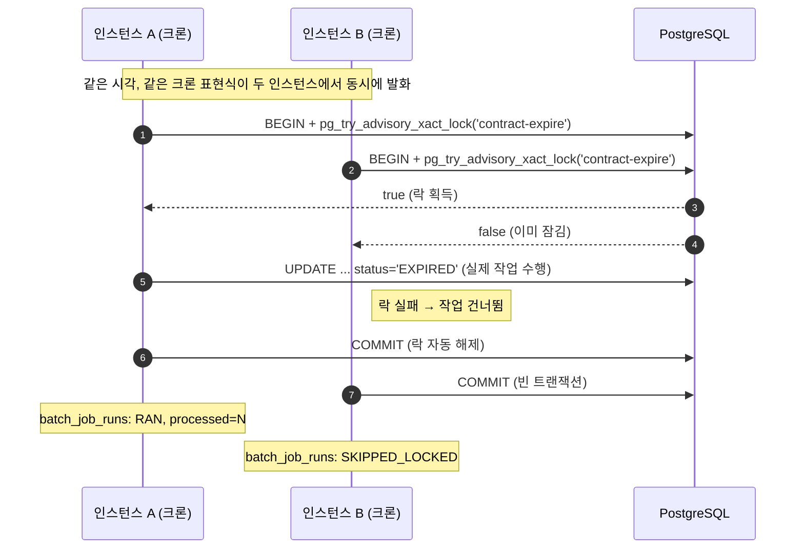
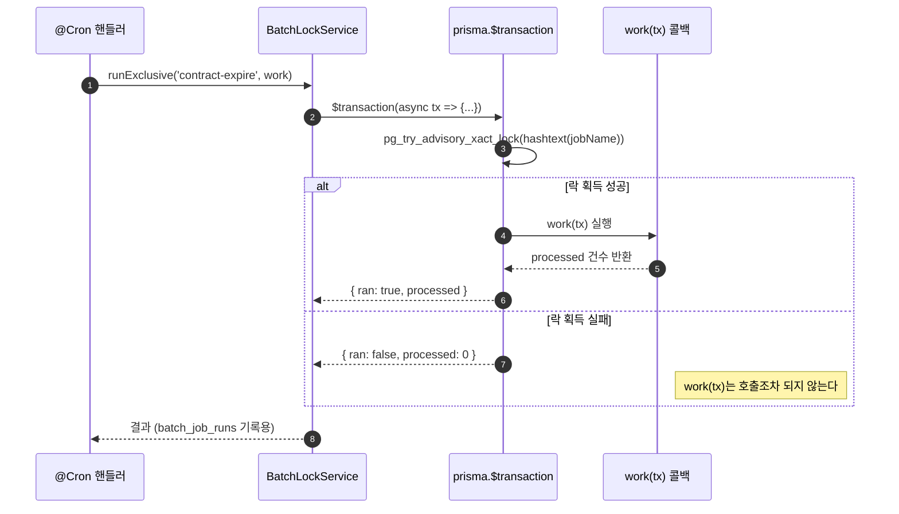
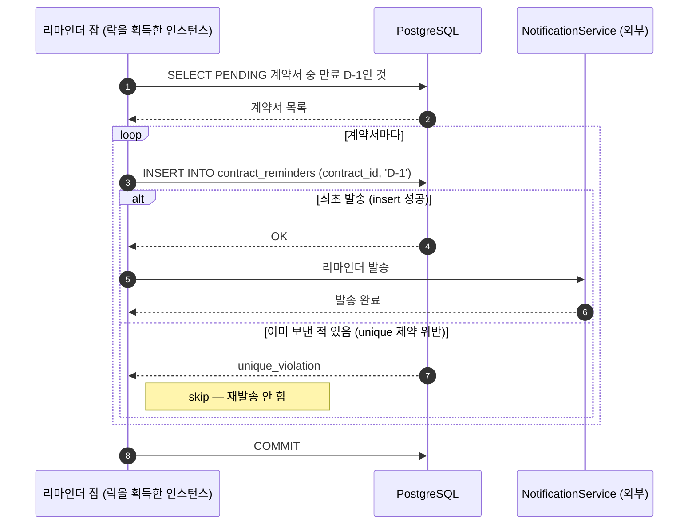

# 근로계약서 만료 처리 · 알림 배치 설계

## 1. 배경

매장 관리자가 직원에게 근로계약서를 보내면 직원은 이를 승인(APPROVED) 또는 거부(REJECTED)한다.
응답에는 마감 기한(만료기간)이 있고, 기한 내에 응답이 없으면 계약서는 자동으로 만료 처리되어야
한다. 또한 기한이 임박했는데 아직 응답이 없는 직원에게는 알림을 보내야 한다.

이 두 가지는 사람의 요청으로 실행되는 것이 아니라 시간 경과에 따라 스스로 실행되어야 하는
**배치(주기 실행) 작업**이다. `whale-erp-api`는 로드밸런서 뒤에 여러 인스턴스로 배포되므로,
같은 크론이 인스턴스 수만큼 동시에 실행되면 계약서가 중복 만료 처리되거나 알림이 중복 발송된다.
이 문서는 그 중복 실행 문제를 어떻게 막을지와, 두 배치 작업의 흐름을 정의한다.

### 한눈에 보기

인스턴스가 몇 대든 결론은 같다 — "동시에 같은 크론이 돈다 → 락을 하나만 얻는다 → 나머지는
아무 일도 안 하고 조용히 끝난다." 아래는 인스턴스가 2대일 때의 예시다(3대 이상도 같은 원리로,
락을 못 얻는 쪽이 하나 늘어날 뿐이다).



이 그림의 각 화살표가 4장·7장의 어느 부분에 해당하는지는 아래에서 구체적으로 이어간다.

## 2. 전제 / 가정

이 기능을 위한 도메인 모델(`employment_contracts` 등)은 아직 코드베이스에 없다. 아래는 이 문서가
배치 설계를 구체적으로 서술하기 위해 두는 가정이며, 실제 계약서 기능 구현 시 확정해야 한다.

- 계약서는 상태를 가진다: `PENDING`(응답 대기) → `APPROVED` / `REJECTED`(직원 응답) 또는
  `EXPIRED`(기한 내 무응답으로 자동 만료).
- 계약서에는 응답 기한 `expires_at` (timestamptz)이 있다.
- "알림 발송"은 기한 임박 리마인더를 뜻한다고 가정한다 (예: 만료 D-1). 발송 채널(푸시/SMS/앱 내
  알림)과 실제 전송 구현은 이 문서의 범위 밖이며, 이미 존재하거나 별도로 설계될 `NotificationService`
  호출부만 가정한다.
- 인스턴스 수는 가변(오토스케일 가능)이고, 서로를 인식하지 못하는 stateless 배포다 — "리더 인스턴스"를
  고정하는 방식은 쓸 수 없다.
- 현재 스택에 Redis 등 락 전용 인프라가 없다(사용자 확인 완료). PostgreSQL만으로 구현한다.

이 가정과 다르면 4~6장의 세부 사항(특히 데이터 모델)은 조정이 필요하지만, 5장의 중복 실행 방지
메커니즘 자체는 계약서 스키마와 무관하게 그대로 적용된다.

## 3. 요구사항

1. 여러 인스턴스가 같은 시각에 같은 크론을 실행해도, 각 배치 작업은 한 사이클에 정확히 한 인스턴스만
   실제 작업을 수행해야 한다.
2. 락을 무한정 붙잡고 죽는 인스턴스가 있어도(크래시, OOM, 강제 종료) 다음 사이클에는 다른 인스턴스가
   반드시 락을 얻을 수 있어야 한다 — 즉 락에 만료/자동 해제가 있어야 한다.
3. 새 인프라(Redis 등) 도입 없이 기존 PostgreSQL로 구현한다.
4. 배치 실행 여부와 결과(성공/스킵/실패)를 사후에 확인할 수 있어야 한다(운영 관측성).
5. 알림은 같은 계약서·같은 시점 기준으로 중복 발송되지 않아야 한다.

## 4. 중복 실행 방지 메커니즘

### 4.0 이 락이 잠그는 대상 — 데이터가 아니라 "잡 실행권"

오해하기 쉬운 지점을 먼저 짚는다. 이 락은 `employment_contracts`의 특정 행이나 계약서 데이터에
대한 수정 권한을 잠그는 게 아니다. `pg_try_advisory_xact_lock`이 거는 대상은 **잡 이름 문자열을
해시한 정수 하나**뿐이다(4.3). PostgreSQL은 이 정수가 무슨 의미인지 전혀 모르고, "이 정수를 누가
먼저 잡았는가"만 관리한다.

그래서:

- 같은 잡 이름을 쓰는 인스턴스끼리만 서로를 막는다 — `contract-expire`끼리는 서로 막고,
  `contract-expiry-reminder`와는 무관하게 동시에 돌 수 있다(4.3).
- 만료 처리 잡(6.1)의 실제 상태 변경은 조건부 `UPDATE` 한 줄로 처리되고, row lock
  (`SELECT ... FOR UPDATE` 등)은 전혀 관여하지 않는다 — advisory lock이 애초에 두 인스턴스가
  동시에 같은 UPDATE를 실행하는 상황 자체를 막아주므로 row 단위 경쟁이 발생하지 않는다.
  row-level 락은 10장에서 "물량이 커지면 검토할 미래 대안"으로 명시적으로 미뤄둔 별개의
  메커니즘이다.

### 4.1 왜 advisory lock인가

후보는 세 가지였다.

| 방식 | 새 인프라 | 자동 해제 | 비고 |
|---|---|---|---|
| Redis 분산 락(Redlock 등) | 필요 | TTL 직접 설계 필요 | 이번 스택엔 과함 (사용자 확인: PostgreSQL 락 채택) |
| 전용 락 테이블 + unique 제약 | 불필요 | 직접 만료 로직 필요 (stale lock 정리 잡 별도 필요) | advisory lock과 목적은 같은데 관리 코드가 더 필요 |
| **PostgreSQL advisory lock** | 불필요 | **트랜잭션/세션 종료 시 자동** | 커넥션이 끊기면(크래시 포함) DB가 즉시 회수 |

advisory lock을 쓰면 "락을 쥔 프로세스가 죽으면 어떻게 되나"라는 질문에 별도 청소 배치 없이 답이
나온다 — 커넥션이 사라지는 순간 Postgres가 락을 풀어준다. 요구사항 2번을 코드 없이 만족시킨다.

### 4.2 트랜잭션 스코프 vs 세션 스코프

advisory lock에는 두 변형이 있다.

- **세션 스코프** (`pg_advisory_lock` / `pg_advisory_unlock`): 락을 잡은 것과 같은 물리 커넥션에서
  풀어야 한다. Prisma는 커넥션 풀을 내부적으로 돌리므로, 일반 `prisma.$queryRaw` 두 번의 호출이
  같은 커넥션을 탄다는 보장이 없다 — 잘못 쓰면 락이 영원히 안 풀리는 사고로 이어진다.
- **트랜잭션 스코프** (`pg_try_advisory_xact_lock`): 락을 잡은 트랜잭션이 COMMIT/ROLLBACK되면
  자동으로 풀린다. Prisma의 `$transaction(async (tx) => {...})` 콜백은 콜백 전체가 하나의 커넥션 위
  하나의 트랜잭션으로 실행됨을 보장하므로, 커넥션 어긋남 문제가 구조적으로 발생하지 않는다.

→ **트랜잭션 스코프(`pg_try_advisory_xact_lock`)를 채택**한다. 배치 본문 전체를 하나의 Prisma
interactive transaction 안에서 실행하고, 그 안에서 제일 먼저 락을 시도한다.

이 선택의 트레이드오프: 배치가 처리하는 행이 아주 많아지면 하나의 트랜잭션이 길어져 커넥션 풀을
오래 붙잡는다. 지금 대상(한 매장 단위 근로계약서)은 한 사이클에 수십~수백 건 규모로 예상되므로
문제가 되지 않는다. 물량이 커지면 11장의 대안을 검토한다.

### 4.3 락 키

락은 정수(bigint) 키로 식별한다. 잡 이름 문자열을 `hashtext()`로 정수화해서 충돌 없이 잡별로
분리한다.

```sql
select pg_try_advisory_xact_lock(hashtext('contract-expire'));
select pg_try_advisory_xact_lock(hashtext('contract-expiry-reminder'));
```

두 잡은 서로 다른 키를 쓰므로 동시에 실행돼도 서로를 막지 않는다 (막을 이유도 없다).

### 4.4 공통 실행 헬퍼

```ts
// src/batch/batch-lock.service.ts
@Injectable()
export class BatchLockService {
  constructor(private readonly prisma: PrismaService) {}

  async runExclusive(jobName: string, work: (tx: Prisma.TransactionClient) => Promise<number>) {
    return this.prisma.$transaction(
      async (tx) => {
        const [{ acquired }] = await tx.$queryRaw<{ acquired: boolean }[]>`
          select pg_try_advisory_xact_lock(hashtext(${jobName})) as acquired
        `;
        if (!acquired) {
          return { ran: false, processed: 0 };
        }
        const processed = await work(tx);
        return { ran: true, processed };
      },
      { timeout: 60_000, maxWait: 5_000 }, // 기본 5s 타임아웃은 배치엔 짧다
    );
  }
}
```

`timeout`은 Prisma interactive transaction의 기본값(5초)을 배치에 맞게 늘린 것이고, `maxWait`은
트랜잭션 시작 자체를 기다리는 시간이라 짧게 둔다 — 락을 못 얻는 인스턴스는 빨리 포기하고 다음
크론 사이클을 기다려야 한다.

"한눈에 보기"의 화살표를 이 코드에 그대로 대응시키면 다음과 같다.



핵심은 `work(tx)`가 락을 못 얻은 인스턴스에서는 아예 호출되지 않는다는 것 — "실행은 됐는데 결과만
버린다"가 아니라 "애초에 실행되지 않는다."

## 5. 스케줄링

`@nestjs/schedule`을 새로 추가한다 (현재 `package.json`에 크론 라이브러리가 없음). 모든 인스턴스가
동일한 `@Cron` 표현식으로 동일한 잡을 등록하고, 실제로 일을 하는지는 4장의 락이 결정한다 — 인스턴스
쪽에서 "내가 리더인가"를 판단하는 코드는 없다.

만료 처리 잡의 주기는 **하루 1회(매일 00:00)**로 확정한다. 알림 잡은 그대로 시간당 1회를 유지한다.

```ts
@Injectable()
export class ContractBatchScheduler {
  constructor(
    private readonly lock: BatchLockService,
    private readonly contracts: ContractExpiryService,
    private readonly reminders: ContractReminderService,
  ) {}

  @Cron(CronExpression.EVERY_DAY_AT_MIDNIGHT)
  async expireContracts() {
    const { ran, processed } = await this.lock.runExclusive('contract-expire', (tx) =>
      this.contracts.expireOverdue(tx),
    );
    // ran === false 는 다른 인스턴스가 같은 사이클을 처리 중이라는 뜻 — 정상, 에러 아님
  }

  @Cron(CronExpression.EVERY_HOUR)
  async sendExpiryReminders() {
    await this.lock.runExclusive('contract-expiry-reminder', (tx) =>
      this.reminders.sendDueReminders(tx),
    );
  }
}
```

주기가 10분에서 하루로 바뀌면 "실패했을 때 다음 자동 재시도까지 얼마나 기다리는가"의 셈법이
완전히 달라진다 — 6.1.1에서 이 문제와 대응 전략을 다룬다.

### 5.1 `CronExpression` 사용법 / 종류

`@Cron()` 데코레이터는 두 방식 중 하나로 스케줄을 지정한다.

1. **`CronExpression` enum 상수** — 자주 쓰는 주기를 이름으로 제공한다. 오타로 인한 사고(예:
   `*/10`을 `/10`으로 잘못 쓰는 것)를 막을 수 있어, enum에 있는 주기라면 이쪽을 우선한다. 이 문서가
   쓰는 `EVERY_DAY_AT_MIDNIGHT`, `EVERY_HOUR`가 그 예다.
2. **cron 표현식 문자열** — enum에 없는 주기(예: "매일 03:00", "평일 09~18시 매 정시")가 필요할 때
   직접 작성한다.

**필드 문법.** `@nestjs/schedule`은 내부적으로 `cron` 패키지를 쓰므로, 표준 5필드(분 단위부터) 외에
초 단위까지 지정하는 6필드 형식도 지원한다.

```
 ┌───────────── 초 (0-59, 생략 가능 — 생략하면 5필드 표준 cron으로 해석)
 │ ┌───────────── 분 (0-59)
 │ │ ┌───────────── 시 (0-23)
 │ │ │ ┌───────────── 일 (1-31)
 │ │ │ │ ┌───────────── 월 (1-12)
 │ │ │ │ │ ┌───────────── 요일 (0-7, 0과 7 둘 다 일요일)
 │ │ │ │ │ │
 * * * * * *
```

- `*` — 매(해당 필드의 모든 값).
- `*/N` — N 간격 (`*/10` in 분 필드 = 10분마다).
- `A-B` — 범위 (`9-18` in 시 필드 = 9시~18시).
- `A,B,C` — 목록 (`0,6` in 요일 필드 = 일요일과 토요일).

예:

| 표현식 | 의미 |
|---|---|
| `'0 0 * * *'` | 매일 00:00 (5필드 표준 cron) |
| `'0 0 0 * * *'` | 매일 00:00 (6필드, `EVERY_DAY_AT_MIDNIGHT`와 동일) |
| `'0 0 3 * * *'` | 매일 03:00 |
| `'0 */10 * * * *'` | 10분마다 |
| `'0 0 9-18 * * 1-5'` | 평일(월~금) 09~18시, 매 정시 |

**자주 쓰는 `CronExpression` 상수** (정확한 전체 목록은 패키지 설치 후 `@nestjs/schedule`의
`CronExpression` 정의에서 확인할 것 — 이 표는 대표적인 것만 정리):

| 상수 | 의미 |
|---|---|
| `EVERY_SECOND` | 매초 |
| `EVERY_5_SECONDS` / `EVERY_10_SECONDS` / `EVERY_30_SECONDS` | N초마다 |
| `EVERY_MINUTE` | 매분 |
| `EVERY_5_MINUTES` / `EVERY_10_MINUTES` / `EVERY_30_MINUTES` | N분마다 |
| `EVERY_HOUR` | 매시 정각 |
| `EVERY_DAY_AT_MIDNIGHT` | 매일 00:00 |
| `EVERY_DAY_AT_1AM` ~ `EVERY_DAY_AT_11PM` | 매일 지정 시각(1시 단위) |
| `EVERY_WEEK` | 매주 일요일 00:00 |
| `EVERY_WEEKDAY` | 평일(월~금) 매일 00:00 |
| `EVERY_WEEKEND` | 토·일 00:00 |
| `EVERY_1ST_DAY_OF_MONTH_AT_MIDNIGHT` | 매월 1일 00:00 |
| `EVERY_QUARTER` | 분기 첫날 00:00 |
| `EVERY_YEAR` | 매년 1월 1일 00:00 |

이 문서가 실제로 쓰는 것: `EVERY_DAY_AT_MIDNIGHT`(`contract-expire`, 6.1)와 `EVERY_HOUR`
(`contract-expiry-reminder`, 6.2).

**타임존 주의.** `@Cron(expression, { timeZone: 'Asia/Seoul' })`처럼 옵션으로 명시하지 않으면
서버(컨테이너/OS)의 로컬 타임존 기준으로 실행된다. 배포 환경 타임존이 KST가 아니면 "매일 00:00"이
실제로는 다른 시각에 도는 사고로 이어질 수 있으므로, 두 잡 모두 `timeZone: 'Asia/Seoul'`을 명시하는
것을 권장한다.

## 6. 잡 정의

### 6.1 계약서 만료 처리 (`contract-expire`, 매일 1회)

```sql
update employment_contracts
set status = 'EXPIRED', updated_at = now()
where status = 'PENDING' and expires_at <= now()
returning id;
```

- 대상: `PENDING` 상태이고 `expires_at`이 지난 계약서.
- 부수 효과 없음(상태 전이만) → 트랜잭션 안에서 끝내도 재실행 안전(idempotent): 이미 `EXPIRED`인
  행은 `where status = 'PENDING'` 조건에 안 걸려 두 번 처리되지 않는다. 이 idempotent 특성이
  6.1.1 실패 복구 전략의 전제다.
- 주기는 **하루 1회(매일 00:00)**로 확정. 애초엔 10분 주기를 가정했으나(분 단위 정밀도가 필요
  없다는 판단), 하루 1회로 바뀌면서 "실패 시 얼마나 오래 방치되는가"의 셈법이 달라진다 — 아래
  6.1.1 참고.

#### 6.1.1 실패 시 재시도 전략

10분 주기였을 때는 실패해도 "다음 사이클(최대 10분 후)에 자동으로 재시도된다"가 사실상 무시해도
되는 지연이었다. 하루 1회로 바꾸면 같은 논리가 **최대 24시간 지연**으로 바뀐다 — 런타임 예외로
이번 사이클이 실패하고 아무 조치도 하지 않으면, 내일 이 시간까지 만료돼야 할 계약서가 `PENDING`
으로 남아있는다. 이게 업무적으로 허용 가능한 지연인지는 이 문서 밖에서 확정해야 하지만, 설계
차원에서는 다음을 전제로 둔다.

1. **락은 실패해도 즉시 풀린다.** `work(tx)`가 예외를 던지면 `$transaction`이 트랜잭션을
   ROLLBACK하고, advisory lock은 트랜잭션 스코프이므로 그 순간 자동 해제된다(4.2). 락이 걸린 채
   멈추는 상황은 없다 — 인스턴스가 크래시하는 경우와 동일하게 처리된다(8장).
2. **감지는 `batch_job_runs`로 한다.** 7장의 실행 이력 테이블에 `FAILED` 상태와 에러 메시지를
   남기고, "오늘자 `contract-expire`에 `RAN`이 없음"을 모니터링/알림으로 건다.
3. **복구는 데이터를 직접 고치는 게 아니라 같은 잡을 재실행하는 것이다.** 6.1의 UPDATE는
   idempotent하므로 하루 중 아무 때나 다시 실행해도 안전하다. 운영자가 DB에서 `status`를 손으로
   바꾸는 대신, 같은 `ContractExpiryService.expireOverdue`를 다시 호출할 수 있는 수단이 있어야
   한다 — 예를 들어 관리자 전용 API(`POST /admin/batch/contract-expire/run` 같은 형태)나 운영
   스크립트로 즉시 재실행. 이 잡도 advisory lock을 그대로 거치므로 정규 배치와 동시에 실행돼도
   서로 충돌하지 않는다.
4. 이 수동 재실행 경로의 구체적인 인증·권한·API 형태는 이 문서 범위 밖이다(9장) — 여기서는
   "idempotent한 잡 함수를 재사용할 수 있는 경로가 있어야 한다"는 요구사항만 못박는다.

리마인더 잡(`contract-expiry-reminder`)은 시간당 주기를 그대로 유지하므로 같은 문제가 훨씬
가볍다 — 실패해도 최대 1시간 후 자동 재시도되고, 6.2의 unique 제약이 중복 발송을 막아준다.

### 6.2 만료 임박 알림 발송 (`contract-expiry-reminder`, 1시간 주기)

만료 처리와 달리 이 잡은 외부 부수 효과(알림 발송)가 있어 **같은 대상에게 두 번 보내지 않는 것**이
핵심 요구사항이다(요구사항 5). 크론 중복 실행은 4장의 advisory lock이 막아주지만, "이미 이 계약서에
D-1 리마인더를 보냈는지"는 별개 문제 — 락과 무관하게 데이터로 보장해야 한다.

접근: 발송 여부를 `employment_contracts`에 직접 기록하지 않고, `(contract_id, reminder_type)`에
unique 제약을 건 별도 테이블에 먼저 "보낼 것"을 기록한다.

```sql
create table contract_reminders (
  id integer generated always as identity primary key,
  contract_id integer not null references employment_contracts(id),
  reminder_type text not null, -- 'D-1' 등
  created_at timestamptz not null default now(),
  unique (contract_id, reminder_type)
);
```

잡 흐름:

```ts
async sendDueReminders(tx: Prisma.TransactionClient) {
  const due = await tx.employmentContract.findMany({
    where: {
      status: 'PENDING',
      expiresAt: { gte: new Date(), lte: addDays(new Date(), 1) },
    },
  });

  let sent = 0;
  for (const contract of due) {
    // unique 제약이 중복 발송의 최종 방어선 — 이미 보냈으면 이 insert가 실패한다
    const inserted = await tx.contractReminder
      .create({ data: { contractId: contract.id, reminderType: 'D-1' } })
      .catch((e) => (isUniqueViolation(e) ? null : Promise.reject(e)));
    if (!inserted) continue;

    await this.notifications.sendContractExpiryReminder(contract); // 외부 호출
    sent++;
  }
  return sent;
}
```



이 그림에서 "이미 보낸 적 있음" 분기가 바로 요구사항 5(중복 발송 금지)를 지키는 지점이다 — 락은
"같은 사이클에 두 인스턴스가 동시에 도는 것"만 막고, "다른 사이클에 같은 계약서를 또 처리하는 것"은
막지 않으므로 `unique` 제약이 별도로 필요하다.

**알려진 한계 (설계상 받아들이는 리스크):** `insert` 성공 후 `notifications.send(...)` 호출과
트랜잭션 COMMIT 사이에 프로세스가 죽으면, `contract_reminders` 행은 롤백되어 사라지지만 외부
알림은 이미 나갔을 수 있다 — 다음 사이클에 같은 리마인더가 한 번 더 나갈 수 있다는 뜻이다. 이
창은 프로세스 크래시뿐 아니라, 루프 도중 특정 계약서 처리에서 던져진 런타임 예외로 트랜잭션
전체가 롤백되는 경우도 포함한다 — 이미 알림을 보낸 앞선 계약서들의 `contract_reminders` 행도
함께 롤백되므로, 다음 사이클에 그만큼 재발송된다. 이는 "최소 1회 발송(at-least-once)"을 받아들이는
흔한 트레이드오프이고, 이 잡은 advisory lock 때문에 애초에 동시에 두 인스턴스가 돌지 않으므로
발생 확률은 (a) 크래시 또는 예외 타이밍이 그 좁은 창에 정확히 걸릴 때로 한정된다. "정확히 1회
(exactly-once)"가 요구사항이라면 11장의 아웃박스 패턴을 검토한다 — 지금 물량(매장 단위 리마인더)
에는 과설계로 판단해 채택하지 않았다.

## 7. 관측성: 실행 이력 테이블

락을 놓쳐서 스킵한 것과 실제로 실패한 것을 구분할 수 있어야 한다(요구사항 4).

```sql
create table batch_job_runs (
  id integer generated always as identity primary key,
  job_name text not null,
  started_at timestamptz not null default now(),
  finished_at timestamptz,
  status text not null, -- 'RAN' | 'SKIPPED_LOCKED' | 'FAILED'
  processed_count integer,
  error text
);
```

`BatchLockService.runExclusive`가 매 실행마다 한 행을 남기도록 감싼다. 4.4의 스케치는 락 획득
성공/실패만 다뤘는데, 여기에 예외 처리를 더하면 다음과 같다.

```ts
async runExclusive(jobName: string, work: (tx: Prisma.TransactionClient) => Promise<number>) {
  const startedAt = new Date();
  try {
    const result = await this.prisma.$transaction(
      async (tx) => {
        const [{ acquired }] = await tx.$queryRaw<{ acquired: boolean }[]>`
          select pg_try_advisory_xact_lock(hashtext(${jobName})) as acquired
        `;
        if (!acquired) return { ran: false, processed: 0 };
        const processed = await work(tx);
        return { ran: true, processed };
      },
      { timeout: 60_000, maxWait: 5_000 },
    );
    await this.recordRun(jobName, startedAt, {
      status: result.ran ? 'RAN' : 'SKIPPED_LOCKED',
      processedCount: result.processed,
    });
    return result;
  } catch (e) {
    // work(tx)가 예외를 던지면 $transaction이 ROLLBACK → 이 시점에 락은 이미 풀려 있다.
    await this.recordRun(jobName, startedAt, { status: 'FAILED', error: String(e) });
    throw e; // 호출부(스케줄러) 로그·알림을 위해 그대로 전파, 여기서 별도 재시도는 하지 않는다
  }
}
```

`catch` 블록에 도달했다는 것 자체가 트랜잭션이 이미 롤백되고 advisory lock도 이미 해제됐다는
뜻이다(4.2, 6.1.1) — 여기서 락 해제를 따로 신경 쓸 필요는 없고, 실패를 기록하는 것만 이 블록의
책임이다. 알림/모니터링(예: "N시간 동안 `RAN`이 한 번도 없음", "`FAILED`가 기록됨")은 이 테이블을
근거로 구성한다 — 별도 크론 감시 도구를 새로 들이지 않고 기존 DB 조회로 처리 가능.

## 8. 장애 시나리오 정리

| 상황 | 결과 |
|---|---|
| 두 인스턴스가 같은 크론을 동시에 시작 | 한쪽만 `pg_try_advisory_xact_lock`을 획득, 다른 쪽은 즉시 `false`를 받고 빈 트랜잭션으로 종료 (블로킹 없음) |
| 락을 쥔 인스턴스가 정상 종료(SIGTERM, graceful shutdown 등)로 내려감 | OS가 TCP 소켓을 정상적으로 닫음(FIN) → Postgres가 즉시 감지해 세션 종료 + 트랜잭션 롤백 → 락 자동 해제(수백 ms 이내). 다음 사이클에 다른 인스턴스가 정상 처리 |
| 락을 쥔 인스턴스가 하드 크래시(SIGKILL, OOM killer, 전원 차단) 또는 네트워크 파티션으로 끊김 | FIN이 전달되지 않아 Postgres가 연결 종료를 바로 알 수 없음 → **TCP keepalive**로 뒤늦게 감지 후에야 롤백·락 해제. keepalive 값(`tcp_keepalives_idle` 등)을 별도로 짧게 설정해두지 않으면 기본값 기준으로 수십 분~수 시간까지 지연될 수 있어, "다음 사이클에는 반드시 락을 얻는다"(요구사항 2)는 보장이 이 경로에서는 자동으로 성립하지 않음 — DB/커넥션 풀에 짧은 keepalive를 명시적으로 설정해야 함 |
| `work(tx)` 실행 중 런타임 예외(버그, 외부 API 오류 등) | 프로세스는 살아있으므로 `$transaction`이 정상적으로 ROLLBACK을 실행 → 락 즉시 해제 → `batch_job_runs`에 `FAILED` 기록(7장) → idempotent한 잡(6.1)은 다음 정기 사이클 또는 수동 재실행(6.1.1)으로 복구, 외부 부수효과가 있는 잡(6.2)은 at-least-once 리스크 구간에 해당 |
| DB 자체가 느려서 트랜잭션이 오래 걸림 | 인스턴스는 살아있는 상태 — `timeout`(60s) 초과 시 Prisma가 트랜잭션을 강제 종료, 락 해제. 다음 사이클 재시도 (위 "하드 크래시" 행과 달리, 이건 프로세스가 살아서 스스로 타임아웃을 실행하는 경우다) |
| 리마인더 발송 후 커밋 전 크래시 | 6.2절의 at-least-once 리스크: 다음 사이클에 같은 리마인더 1회 재발송 가능 |

## 9. 이번 설계에서 다루지 않는 것

- `employment_contracts`, 계약서 승인/거부 API 자체의 스키마와 엔드포인트 설계.
- 알림 실제 전송 채널(푸시/SMS/앱 내) 및 `NotificationService`의 내부 구현.
- 계약서 최초 발송 시점 알림(이 문서는 "임박 리마인더"만 다룸) — 필요하면 같은 락 패턴을 그대로
  재사용해 별도 잡으로 추가하면 된다.
- 6.1.1에서 언급한 수동 재실행 엔드포인트/스크립트의 구체적인 인증, 권한, API 형태.

## 10. 향후 물량이 커질 경우의 대안 (지금은 채택하지 않음)

- **행 단위 락(`SELECT ... FOR UPDATE SKIP LOCKED`)**: 잡 전체를 하나의 트랜잭션/락으로 묶지 않고,
  여러 인스턴스가 동시에 서로 다른 행을 나눠 처리하게 하는 방식. 처리량이 늘어 하나의 트랜잭션으로
  묶기엔 느려질 때 검토.
- **아웃박스 패턴**: "보낼 알림"을 트랜잭션 안에서 커밋까지 확정한 뒤, 실제 발송은 커밋 후 별도
  단계(또는 별도 잡)에서 수행해 6.2절의 at-least-once 창을 없앤다. 정확히 1회 발송이 실제 요구사항이
  되면 도입.
